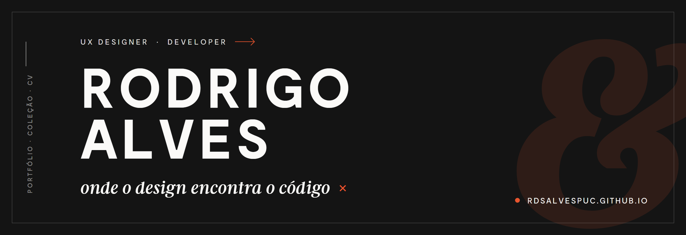

  

  <a href="https://rdsalvespuc.github.io/rdsalvesPUC/"><b>Site</b></a>
  &nbsp;·&nbsp;
  <a href="https://rdsalvespuc.github.io/rdsalvesPUC/portfolio.html">Portfólio</a>
  &nbsp;·&nbsp;
  <a href="https://rdsalvespuc.github.io/rdsalvesPUC/colecao.html">Coleção</a>
  &nbsp;·&nbsp;
  <a href="https://rdsalvespuc.github.io/rdsalvesPUC/cv.html">CV</a>
  &nbsp;·&nbsp;
  <a href="https://www.linkedin.com/in/rdsalves">LinkedIn</a>

---

**UX Designer há 15 anos, desenvolvedor por escolha.** Projetei produtos digitais
centrados no usuário para clientes como Grupo Casas Bahia, Rede D'Or, FGV, Americanas,
Coca-Cola e e-Bricks Ventures. Hoje curso a minha segunda graduação — Sistemas de
Informação na PUCPR — unindo design e código no mesmo lugar.

👉 **[Conheça o meu trabalho](https://rdsalvespuc.github.io/rdsalvesPUC/)** — portfólio,
coleção de criações e currículo.
